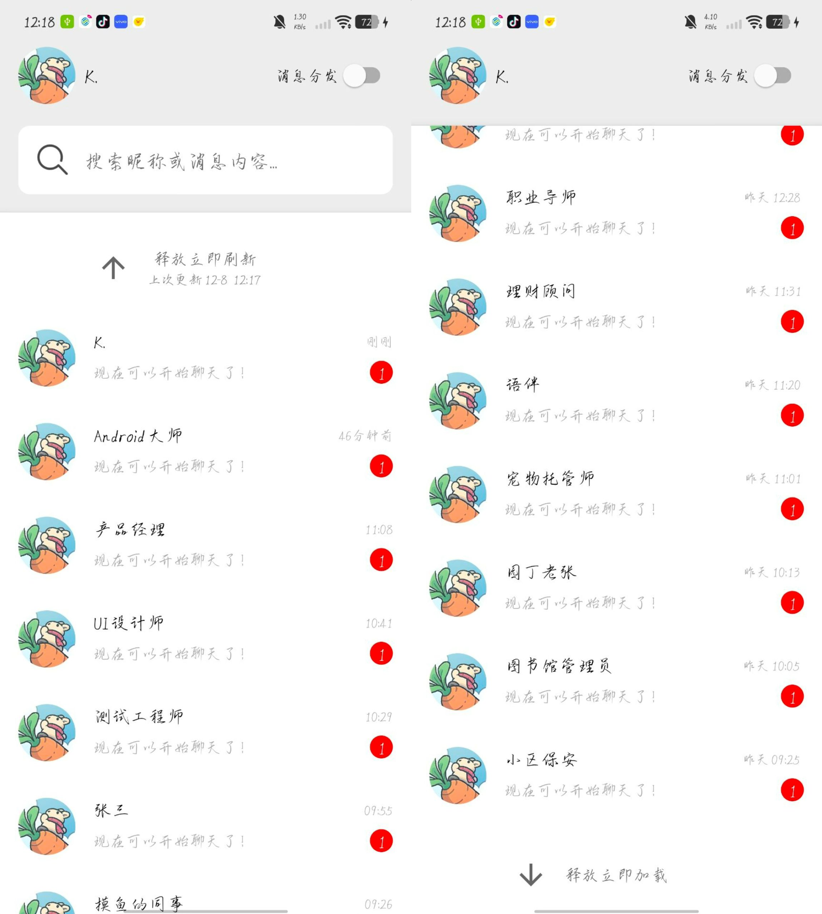
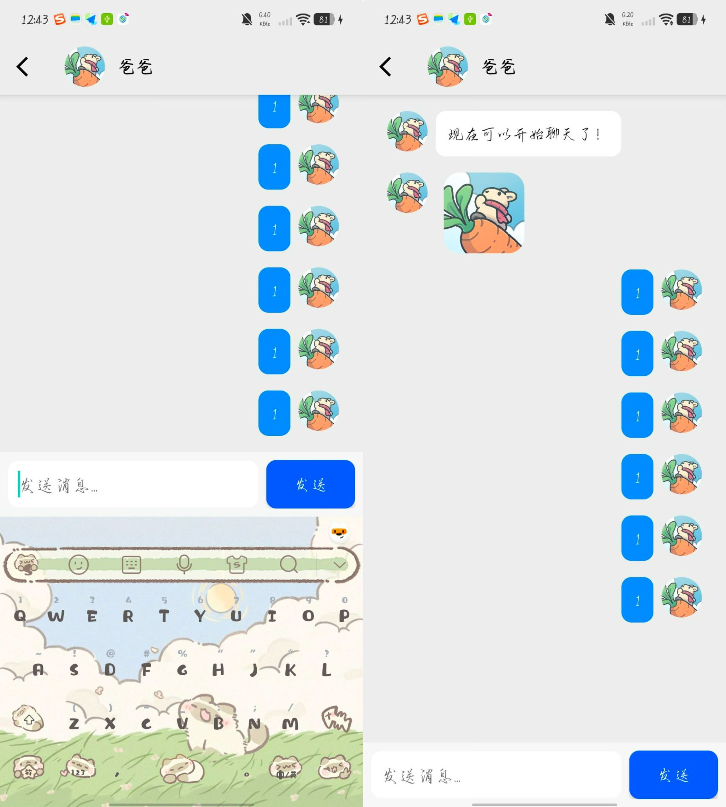
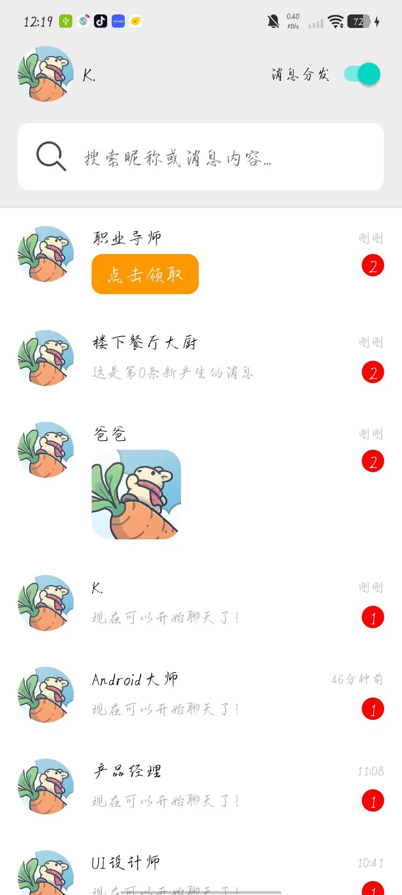
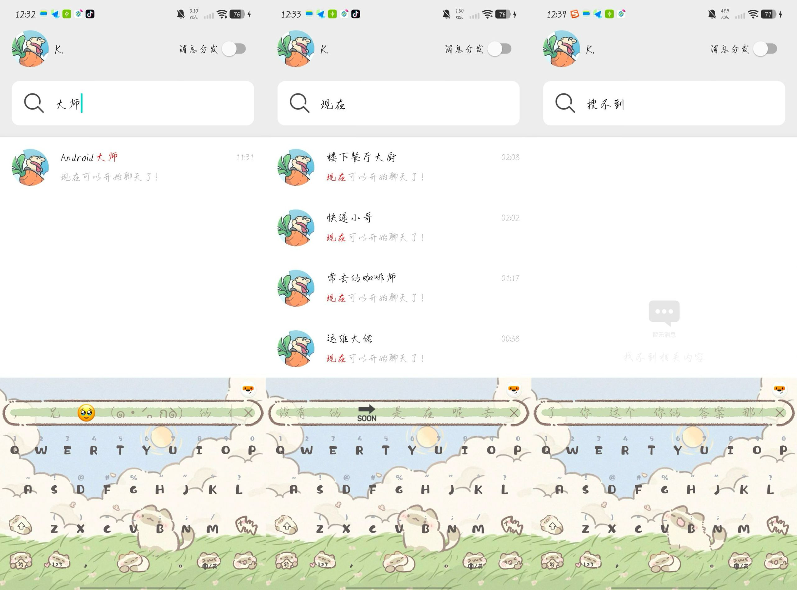
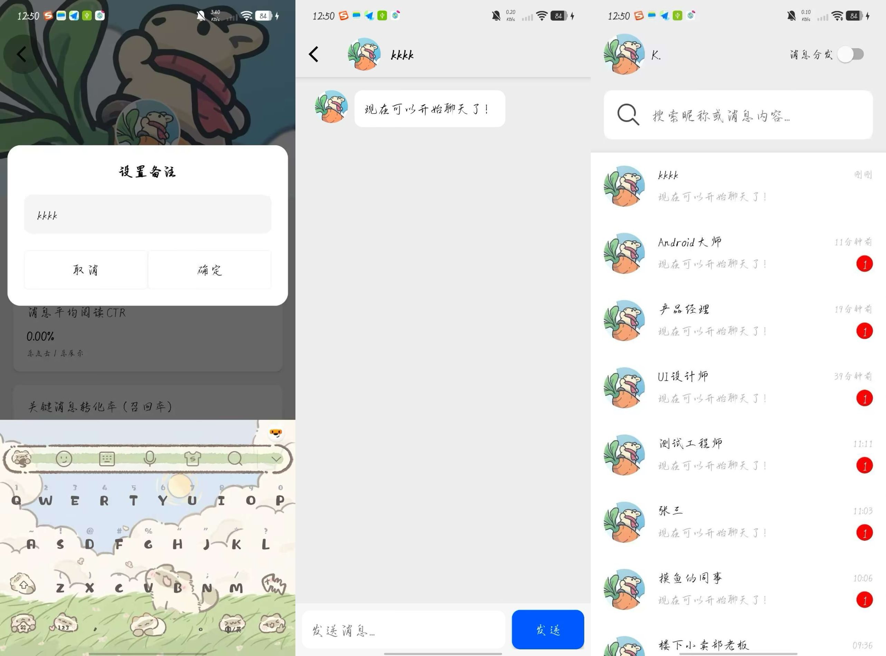
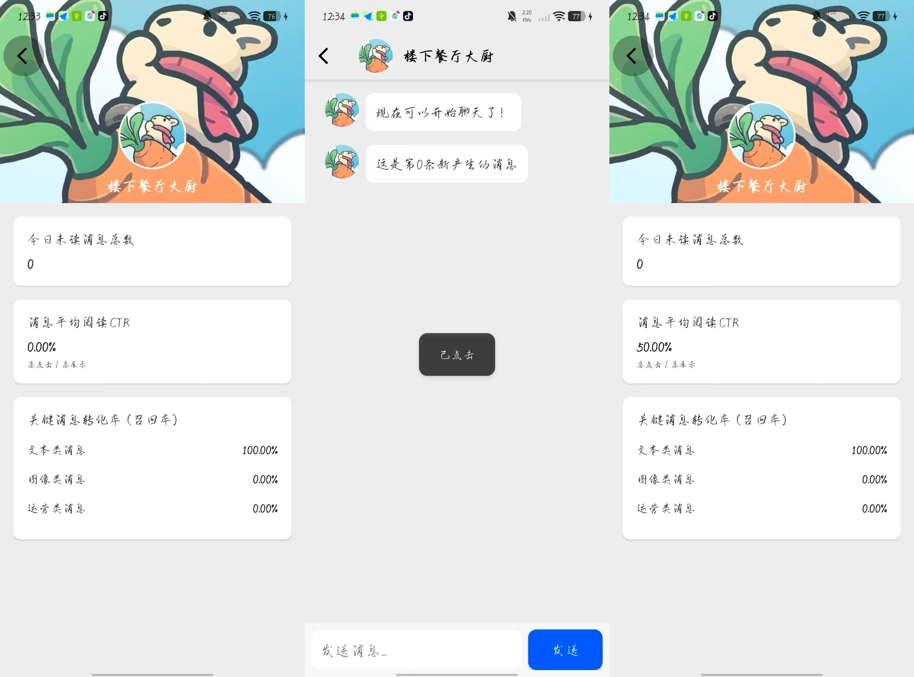

# DYMessageLite
## 项目简介

DYMessageLite是基于Kotlin和View组件开发的简易版抖音列表，并包含了下拉刷新、上拉加载等常见交互。

项目整体采用MVC架构，配合观察者模式进行消息传递

## 项目地址

https://github.com/Sixaven/DYMessageLite

## 功能介绍

### 功能1：消息列表的上拉加载和下拉刷新

使用swiperefreshlayout实现上拉加载和下拉刷新，加载失败时会展示空态页面（和搜索列表复用空态页在这里暂不展示）

### 功能2：消息对话

在消息详情页用户自己也可以发送消息，不过目前暂时只能发送文本类消息，发送的消息都会被持久化，在输入法弹起以及新消息进入列表时，UI都会自动滑动到最底部，保证正常预览

### 功能3：本地消息分发中心

消息列表顶部的开关控制消息分发的开始和关闭，每隔3s就产生一条新消息进入消息列表并实时刷新，同时消息cell的未读数、消息摘要、时间文案也会发生相应更新，分发中心支持纯文本、照片、按钮（运营类消息）三种消息体裁

### 功能4：消息搜索

消息搜索功能支持昵称+消息内容搜索（暂不支持搜索备注），显示搜索结果时与消息列表复用同一个Adapter，并将命中关键词高亮显示，搜索失败则展示空态页面

### 功能5：设置备注+数据看板

点击消息列表的头像、消息列表中运营类消息的按钮以及消息详情页中的好友昵称都可以进入备注页，在备注页中可以设置当前好友的备注，还会显示当前好友所发消息的今日未读数，消息阅读的CTR、三类消息的召回率，在消息详情页的每一条cell都可以点击，同时相应的CTR也会发生变化

- 设置备注

  

- 数据看板

##  技术方案

*   **核心语言**: [Kotlin](https://kotlinlang.org/) - 项目完全使用 Kotlin 编写。
*   **异步处理**: [Kotlin Coroutines](https://developer.android.com/kotlin/coroutines) - 用于处理后台任务，如数据库读写
*   **架构组件 **:
    *   **UI**: [View Binding](https://developer.android.com/topic/libraries/data-binding/view-binding) - 用于安全地访问视图，替代 `findViewById`。
    *   **列表**: [RecyclerView](https://developer.android.com/guide/topics/ui/layout/recyclerview) - 高效展示可滚动的消息列表。
    *   **刷新**: [SwipeRefreshLayout](https://developer.android.com/develop/ui/views/touch-and-input/swipe-to-refresh) - 实现下拉刷新和上拉加载功能。
    *   **数据持久化**: [Room](https://developer.android.com/training/data-storage/room) - 作为本地数据库，存储和管理消息及用户信息。
*   **设计模式**:
    *   **MVC** - 用于解耦 UI 逻辑和业务/数据逻辑。
    *   **观察者模式** 

## 难点分析与解决方案

### 1. UI 列表实时刷新与流畅滚动的平衡
*   **问题**: 消息分发仓库会定时插入新消息。当新消息插入数据库后，需要实时通知 UI 刷新列表。如果在刷新后立即滚动到顶部，动画会显得生硬。
*   **解决方案**:
    1.  使用观察者模式将视图对应的control注册到仓库类中，试试监听状态变化，实现数据的自动响应。
    2.  当新数据更新到 `Adapter` 后，使用 `postDelayed` 轻微延迟滚动操作 。这样可以等待 `RecyclerView` 的布局和绘制完成后再执行滚动，保证了动画的流畅性。

### 2. 昵称+内容混合搜索
*   **问题**: 搜索功能需要同时匹配用户昵称（`UserEntity`）和消息内容（`MessageEntity`），这两部分数据存储在不同的表中。
*   **解决方案**:
    1.  在 `Repository` 层中，使用协程并发查询 `MegEntity（消息列表数据）` 和 `ChatEntity（消息详情数据）` 两张表，获取两个独立的 `List`，之后在以Chat表中数据中为基础进行合并，去重，并统一包装成 UI 层可直接使用的模型列表。
    3.  使用 `SpannableString` 对搜索结果中的匹配关键词进行高亮显示。

### 3. 列表性能与复用
*   **问题**: 消息列表和搜索结果列表的 UI 结构相似，如果创建两个不同的 `Adapter` 会导致代码重复。
*   **解决方案**: 设计一个通用的视图模型，并将消息列表的视图模型和搜索结果的的数据模型在提交adapter显示之前通过扩展函数统一转化成通用视图模型。然后在 `Adapter` 内部，通过视图内部的类型字段和`when` 语句判断当前位置的数据类型，并绑定到对应的 `ViewHolder`，从而实现一个 Adapter 对多种视图类型的复用。

### 4.应用全局的实时消息分发与状态同步

- **问题:** 仓库类模拟产生的消息，需要根据应用当前所处的界面（在前台还是后台？在列表页还是在聊天详情页？）来决定不同的 UI 行为。例如，在列表页时应刷新列表并增加未读数；而在对应的聊天详情页时，应直接显示消息而不是增加未读数。

- 解决方案:

  i.单例分发仓库: 将负责产生和分发消息的 Repository 类设计为单例模式。这确保了应用中只有一个消息源，无论是消息列表页还是聊天详情页，都能订阅和接收到同一个消息流，避免了数据不一致。

  ii.应用状态管理: 创建一个全局的应用状态管理单例类（如AppTracker）。这个类负责记录当前应用所处的 Activity。

  iii.生命周期感知: 在各个 Activity的生命周期函数（onResume, onStop）中，向这个应用状态单例类注册或注销当前页面的状态。

  iv.智能分发: 

  - 当 Control 从单例仓库接收到新消息时，它会首先查询应用状态管理类：如果应用在前台且位于列表 Activity，则直接刷新列表，对应会话的未读数增加。
  - 如果应用位于聊天详情 Activity，并且新消息的发送者 ID 与当前聊天对象 ID 匹配，则直接在详情页显示新消息，不增加未读数。

## 目录结构

com.example.dymessagelitelite
├── data //  Model 层
│ ├── datasource // 数据服务
│ │ ├── dao // 数据库访问对象 
│ │ └── database // 数据库定义 
│ │ 
│ ├── model // 数据模型类
│ └── repository // 仓库层 

├── ui // 视图层 (View+Control)
│ ├── main // 消息列表页
│ ├── detail // 消息详情页
│ └──dashborad//控制台（备注页）
│
└── common

   ├── observer//自定义观察者模式
   ├── tracker//应用状态工具
   ├── utils  //json处理以及像素单位转换 
   ├── mapper //视图模型的转换工具
   └── tracker//应用状态工具

